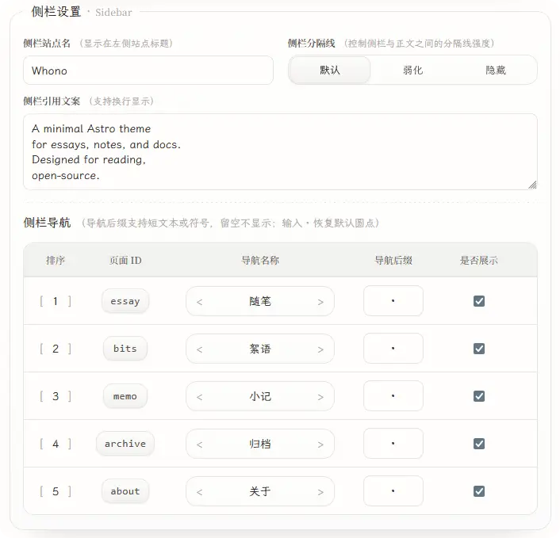
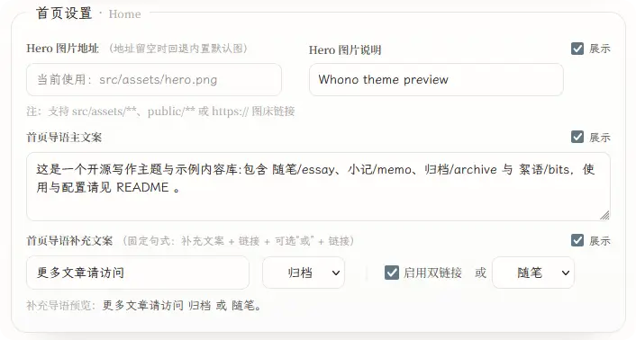
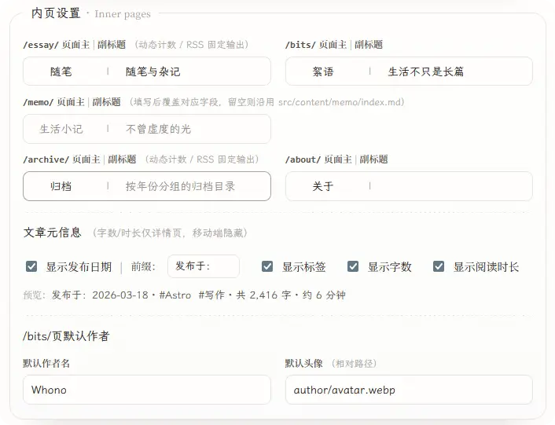

astro-whono 提供一个本地 Theme Console，用于在开发环境中集中管理主题级配置。

`/admin`主要覆盖站点信息、侧栏、首页、内页文案，以及部分阅读与代码显示选项，便于在 fork 或 clone 后统一调整这些主题设置。

:::note[开发环境]
`/admin` 仅在开发环境可写。生产环境访问该路径时，只显示只读提示。
:::

## 本地启动与入口

本地开发时，可通过以下命令启动项目：

```bash
npm install
npm run dev
```

默认情况下，开发服务器会运行在 `http://localhost:4321/`。启动后可直接访问：

```text
http://localhost:4321/admin/
```

如果本地修改了开发端口，请将 `4321` 替换为实际端口。

## 适用范围

Theme Console 当前适合处理以下几类配置：

- 站点标题、默认语言、默认 SEO 描述
- 页脚年份与版权文案
- 社交链接及其排序
- 侧栏站点名、引用文案、导航顺序与显隐
- 首页 Hero、首页导语及首页内部入口
- `/essay/`、`/archive/`、`/bits/`、`/memo/`、`/about/` 的主副标题
- 文章元信息显示选项
- 代码块行号与阅读模式入口

## 配置文件

保存后的设置会按分组自动写入 `src/data/settings/`：

```text
src/data/settings/
  site.json
  shell.json
  home.json
  page.json
  ui.json
```
> 若 src/data/settings/*.json 尚不存在，首次在 /admin 保存时会自动生成

Theme Console 管理的是仓库内的主题配置，相关改动仍可通过 Git 进行跟踪和回退。

## 页面分组

`/admin` 当前按编辑场景拆分为五组。

### Site

`Site` 负责站点层面的基础信息：

- 站点标题
- 默认语言
- 默认 SEO 描述
- 页脚年份与版权文案
- 社交链接

其中社交链接支持固定平台与自定义链接混排，并允许统一排序。

### Sidebar

`Sidebar` 负责壳层与导航相关配置：

- 侧栏站点名
- 侧栏引用文案
- 侧栏分隔线样式
- 导航名称、排序、后缀字符与显隐状态



### Home

`Home` 负责首页展示相关配置：

- Hero 图片地址与说明文字
- Hero 显隐
- 首页导语主文案
- 首页导语补充文案
- 补充导语中的主链接与第二链接



首页补充导语仍采用固定句式，后台只开放了文案和入口选择，尽量保持首页结构稳定。当前可选入口包括 `archive`、`essay`、`bits`、`memo`、`about` 和 `tag`。


### Inner Pages

`Inner Pages` 负责内页层面的统一文案与显示策略：

- `/essay/` 页面主副标题
- `/archive/` 页面主副标题
- `/bits/` 页面主副标题
- `/memo/` 页面主副标题
- `/about/` 页面主副标题
- 文章元信息是否显示日期、标签、字数、阅读时长
- `/bits/` 默认作者名与头像




### Reading / Code

- 是否在代码块中显示行号
- 是否在侧栏显示阅读模式入口


## 保存机制

- 保存按 `site / shell / home / page / ui` 分组回写，不直接修改模板源码
- 多数字段提供即时预览或明确的页面对应关系
- 保存前会执行字段校验
- 保存时会附带版本信息，用于避免并发修改造成的静默覆盖
- 写入过程包含失败回滚，避免多文件半成功状态

---

以上内容覆盖了 Theme Console 当前常用的配置入口与保存机制。如果在使用时发现配置异常或保存问题，欢迎提交 Issue。
